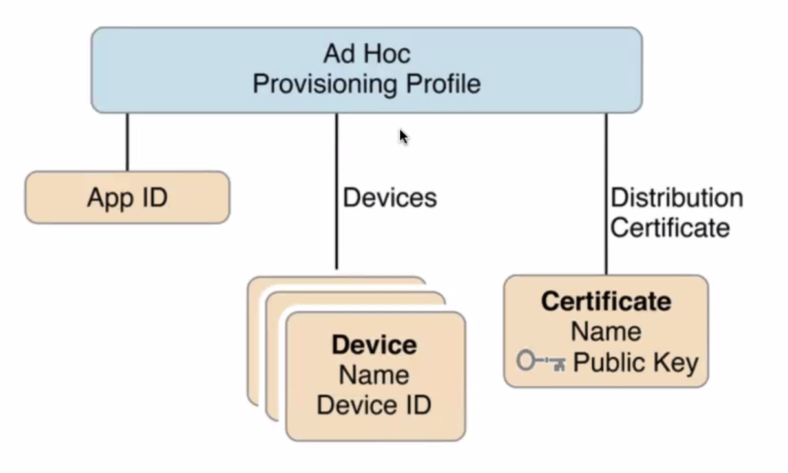
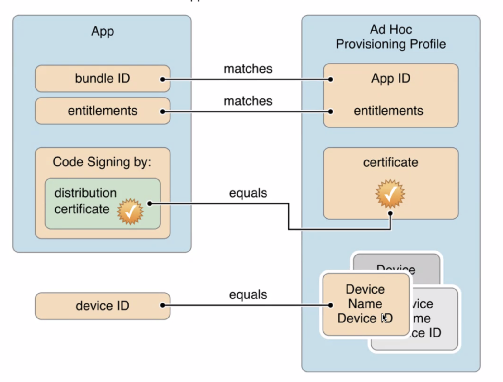

# TIL_220315

### 개요 / 키워드
`BST`

## 배운 것

### 
- Project
  앱의 파일과 리소스를 킵 하는 곳
- Target 
  파일과 리소스를 어떻게 모아서 제품으로 만들어 낼건지..
  product to build
  앱의 상세
- Scheme
    - collection of setting
    - executable environment to use when the product is launched
    - 테스트 만을 위한 환경설정?
    - 사용자가 실제로 앱을 다운받아서 실행하는거랑은 관계가 없습니다. 
- 배포
  - 앱스토어 커넥트
  - 엔터프라이즈
  - Ad Hoc
    - 내부 테스트용
    - test flight
  - Copy App
    - 확인되지 않은 개발자가 만든 앱입니다

- 코드 사이닝
  - certificate 로 보호 
  - signningCertificates -> build and sign -> signed app

- provisioning profile
  - 각 통로에 따른 실행될 수 있는 환경

- target setting
  - info : info.plist
  - bundle identifier -> 유일해야함
## 이력서

- 사진 안넣는게 추세
- 학력도 안넣는게 추세
- 키워드 1개(자잘한 키워드 3개)
- 한글로 쓰자
- 내가말한 키워드에는 근거가 있어야 한다.

- 내가 받고 싶은 질문이 나오게하는 힌트지

- 링크는 클릭해 보지 않는다..
  - 사용한 기술 및 아키텍쳐 정보
  - 기능별 스크린샷
    - 해당 화면 구현을 위해 사용한 기술정보
  - 움짤, 영상
  - 고민한지점, 해결한방법, 결론, 배운점
  - 구조를 이렇게 바꿔봤는데 이런점이 좋은 것 같고
  - 다음번엔 다르게 바꿔서 해야겠습니다. 

---
### Feeling

### Question & Trouble

### Futher Learning

### Reference